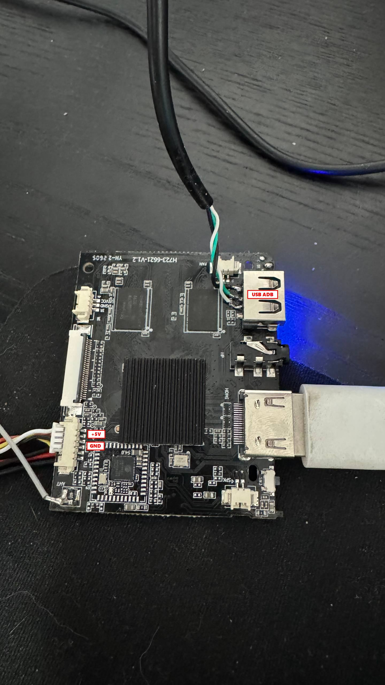
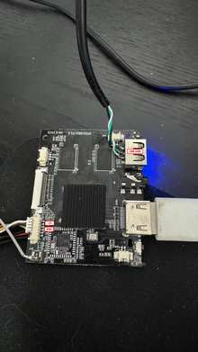

# Allwinner H723 Android root access — H723-6621-V1.2

A reproducible hardware/software guide based on a real rooting session on an Android board built around **Allwinner H723 / sun50iw15p1**.

The **tested PCB is H723-6621-V1.2**. A board sold/marked as **H723-CY-4D308** looks very similar, but it has **not** been verified by this repository. Treat it as a different target until its GPT, boot layout and Secure Storage contents have been read and checked.

> [!CAUTION]
> This procedure includes raw eMMC writes. A wrong LBA, a wrong firmware image, or a power loss at the wrong moment can brick the board. The public scripts in this repository are deliberately conservative: they validate hashes/CRCs, default to read-only/dry-run behavior, and do not reboot automatically after critical writes.

## Tested board

### UART location



The photo marks the UART connector area. **It does not document the exact GND/TX/RX pin order. Do not infer pin order from wire colors.** Confirm it on your board before connecting a USB-UART adapter.

UART settings used during the work:

```text
115200 baud
8 data bits
no parity
1 stop bit
no flow control
```

### Recovery USB ADB wiring



The recovery connection is the important part that is easy to miss:

- network/TCP ADB works while normal Android is running;
- after `adb reboot recovery`, **network ADB is gone** on this board;
- recovery ADB requires a **physical USB data connection** soldered to the USB-A connector/data lines on the PCB;
- keep UART connected in parallel for U-Boot/recovery logs and the raw-dump scripts.

The second photo also marks the +5 V/GND points used in the test setup. Do not connect two 5 V sources together unless you have checked how your board is powered.

---

## What was actually verified

The test unit reported an H723/sun50iw15p1 platform, Android 14/API 34 and an A/B partition layout. The captured U-Boot environment and boot logs show active slot `_a`, `boot_a` as the kernel-side boot image, and `init_boot_a` as the source of the generic ramdisk (`ramdisk use init boot`).

The successful chain was:

```text
stock Android
    |
    | adb reboot recovery
    v
recovery
    |-- physical USB ADB (soldered USB data connection)
    `-- UART 115200 8N1
    |
    v
read and validate GPT
    |
    v
back up boot_a / init_boot_a / vendor_boot_a / vbmeta_a / misc / env_a
    |
    v
read Allwinner Secure Storage
    |
    v
add device_unlock=unlock
add fastboot_status_flag=unlocked
rebuild CRCs + redundant copies
    |
    v
safe raw write + per-block read-back + full read-back
    |
    v
U-Boot AVB state: LOCKED/GREEN -> UNLOCKED/ORANGE
    |
    v
Magisk patch of init_boot_a
    |
    | adb reboot bootloader
    v
Allwinner USB fastboot 1f3a:1010
    |
    v
flash init_boot_a
    |
    v
Android -> magiskd -> su -> uid=0(root)
```

### Reproducibility note

The documented root path is: **unlock the Allwinner boot state through Secure Storage, verify `LOCKED/GREEN -> UNLOCKED/ORANGE`, then patch `init_boot_a` with Magisk and flash the patched `init_boot_a`.**

Original session scripts, reconstructed utilities, and publication-hardened tools are kept in separate directories so their roles are clear. See [`docs/session-script-inventory.md`](docs/session-script-inventory.md).

---

# 1. Host setup

Examples use Windows PowerShell because that is how the board was tested.

Install:

- Android Platform Tools (`adb.exe`)
- Python 3
- a USB-UART adapter capable of 3.3 V logic
- `pyserial`
- `pyusb`

```powershell
python -m pip install -r requirements.txt
```

For the Allwinner bootloader interface on Windows, PyUSB must be able to claim USB device `1f3a:1010`. If Python cannot see it, a libusb-compatible driver may be required for that interface.

Do not start any raw-write step until you have working UART access and verified backups.

---

# 2. Start in normal Android

Check ADB:

```powershell
.\adb.exe devices -l
```

Network ADB is acceptable **at this stage**. For example, if your normal Android ADB target is an IP address, you can still use it to request recovery.

Capture basic properties before changing anything:

```powershell
.\adb.exe shell getprop ro.build.version.release
.\adb.exe shell getprop ro.build.version.sdk
.\adb.exe shell getprop ro.product.cpu.abi
.\adb.exe shell getprop ro.boot.slot_suffix
.\adb.exe shell getprop ro.boot.vbmeta.device_state
.\adb.exe shell getprop ro.boot.verifiedbootstate
.\adb.exe shell getprop ro.boot.veritymode
.\adb.exe shell uname -a
.\adb.exe shell getprop > getprop-stock.txt
```

Keep the UART adapter connected and start a boot-log capture before rebooting:

```powershell
python .\scripts\uart_log_capture.py COM5 --out boot-before-unlock.log
```

Use your actual COM port.

---

# 3. Enter recovery correctly

Request recovery from the currently running Android:

```powershell
.\adb.exe reboot recovery
```

If the normal Android connection is TCP ADB, an explicit target is safer:

```powershell
.\adb.exe -s 192.168.x.x:5555 reboot recovery
```

On the tested unit, the UART log showed U-Boot finding `misc` and the `boot-recovery` request on the following boot.

## Critical transport change

Once recovery starts, **do not wait for the old network ADB endpoint to return**. It will not.

Connect the physically soldered USB data connection shown in the board photo and check:

```powershell
.\adb.exe devices -l
.\adb.exe shell id
```

A helper is included:

```powershell
.\scripts\recovery_usb_adb.ps1 -Adb .\adb.exe -Target 192.168.x.x:5555
```

The helper requests recovery from the normal-Android target, then deliberately waits for a **non-network** ADB serial so it does not accidentally reconnect to the old TCP target.

Keep UART connected at the same time. The original raw-eMMC tools use the recovery UART shell.

---

# 4. Discover the partition table instead of guessing

Do not start with `mmcblk0p5`, `p9`, etc. Those numbers came from **this** unit's GPT and must be rediscovered on another board/firmware.

The original session read the first 34 eMMC sectors from the recovery UART shell. The hardened equivalent is:

```powershell
python .\scripts\uart_dump.py COM5 --skip 0 --count 34 --out gpt34.bin
```

Then validate and parse it:

```powershell
python .\scripts\gpt_inspect.py .\gpt34.bin
```

`gpt_inspect.py` verifies:

- MBR signature `55 aa`;
- GPT signature `EFI PART`;
- GPT header CRC32;
- partition-entry-array CRC32;
- entry bounds and sizes.

For the supplied test-unit GPT the validation result is:

```text
GPT header CRC32:        6ad342cd
partition array CRC32:   534057f5
partition entries:       29 x 128 bytes
```

The complete verified partition map is in [`docs/partition-map.md`](docs/partition-map.md).

The partitions that matter most to this procedure on the tested `_a` slot are:

| Partition | Linux node on tested unit | First LBA | Sectors | Size | Why it matters |
|---|---|---:|---:|---:|---|
| `env_a` | `mmcblk0p3` | 204800 | 512 | 256 KiB | confirms slot/boot environment |
| `boot_a` | `mmcblk0p5` | 205824 | 131072 | 64 MiB | contains the kernel-side boot image |
| `vendor_boot_a` | `mmcblk0p7` | 467968 | 65536 | 32 MiB | split Android boot layout backup |
| `init_boot_a` | `mmcblk0p9` | 599040 | 16384 | 8 MiB | generic ramdisk; Magisk target |
| `misc` | `mmcblk0p12` | 5874688 | 32768 | 16 MiB | recovery/bootloader boot commands |
| `vbmeta_a` | `mmcblk0p13` | 5907456 | 256 | 128 KiB | AVB metadata; backup before experiments |

You can have the parser print read-only backup commands from **your** GPT:

```powershell
python .\scripts\gpt_inspect.py .\gpt34.bin --dump-plan COM5
```

---

# 5. Why these partitions were selected

The choice was not based only on Android conventions.

The recovered `env_a` image contains:

```text
slot_suffix=_a
ab_partition_list=bootloader,env,boot,vendor_boot,dtbo,vbmeta,vbmeta_system,vbmeta_vendor,init_boot,Reserve0
boot_fastboot=fastboot
```

The U-Boot log independently showed:

```text
partinfo: name boot_a, start 0x32400, size 0x20000
androidboot.slot_suffix=_a
ramdisk use init boot
pubkey vbmeta_a valid
```

Therefore:

- active slot was `_a`;
- `boot_a` is the kernel-side boot image and was backed up as a recovery/reference image;
- the generic ramdisk came from `init_boot_a`, so that is the correct Magisk target;
- `vbmeta_a`, `vendor_boot_a`, `misc` and `env_a` are important recovery/reference backups even though the final Magisk flash only wrote `init_boot_a`.

See [`docs/boot-chain.md`](docs/boot-chain.md).

---

# 6. Extract the stock boot images and back up the partitions

This is the point where the boot images are actually copied from eMMC to the PC. Do this **after** reading/validating the GPT and **before** any Secure Storage or boot-image modification.

On this board there are two different images that are easy to confuse:

- `boot_a` — 64 MiB kernel-side boot image;
- `init_boot_a` — 8 MiB Android boot v4 image containing the generic ramdisk. **This is the image later patched by Magisk.**

The tested GPT gives:

```text
boot_a:      first LBA 205824, sectors 131072
init_boot_a: first LBA 599040, sectors 16384
```

## 6.1 Extract `boot_a`

Using the publication-hardened dumper:

```powershell
python .\scripts\uart_dump.py COM5 `
  --skip 205824 `
  --count 131072 `
  --out boot_a-stock.img
```

The original session tool that performs the same `dd if=/dev/block/mmcblk0 ... | base64` transfer is preserved as `reference/session-scripts/uartdump.py`.

Expected size for this tested GPT:

```text
131072 * 512 = 67108864 bytes = 64 MiB
```

## 6.2 Extract the stock `init_boot_a` used for Magisk

This is the missing transition between partition discovery and the later Magisk step:

```powershell
python .\scripts\uart_dump.py COM5 `
  --skip 599040 `
  --count 16384 `
  --out init_boot_a-stock.img
```

Expected size:

```text
16384 * 512 = 8388608 bytes = 8 MiB
```

For the tested unit, the extracted stock image was verified as:

```text
SHA-256:
2d0b2683e03e3edea8e5e47426e23088e0f0da112f2c597ac84e6e400873dca0
```

Keep `init_boot_a-stock.img` untouched as the recovery copy. Create the working input for Magisk from that verified dump:

```powershell
Copy-Item .\init_boot_a-stock.img .\init_boot_a.img
Get-FileHash .\init_boot_a.img -Algorithm SHA256
```

The copy must still be exactly 8,388,608 bytes and, on the tested unit, must still have the SHA-256 shown above.

## 6.3 Back up the remaining relevant partitions

Do the same for at least:

```text
env_a
vendor_boot_a
misc
vbmeta_a
```

Use the LBAs and sector counts printed from **your own GPT**. You can generate the read-only commands automatically:

```powershell
python .\scripts\gpt_inspect.py .\gpt34.bin --dump-plan COM5
```

At the end of this stage you should have at minimum:

```text
boot_a-stock.img
init_boot_a-stock.img
vendor_boot_a-stock.img
vbmeta_a-stock.img
misc-stock.img
env_a-stock.img
```

Generate a hash manifest:

```powershell
.\scripts\sha256_manifest.ps1 -Path . -OutFile .\SHA256SUMS-stock.txt
```

Store a second copy somewhere that will not be modified during the experiment. Do not continue until the 8 MiB `init_boot_a` dump has been verified, because that exact image is the source for the Magisk patch later in this guide.

---

# 7. Confirm the original LOCKED/GREEN state

Before the Secure Storage modification, the captured U-Boot log showed that the two unlock items were absent:

```text
no item name device_unlock in the map
no item name fastboot_status_flag in the map
sunxi secure storage has no flag
```

AVB still verified normally and U-Boot reported the same `vbmeta_a` public-key path used later:

```text
pubkey vbmeta_a valid
androidboot.vbmeta.device_state=locked
androidboot.veritymode=enforcing
androidboot.verifiedbootstate=green
```

Analyze your saved UART log with:

```powershell
python .\scripts\avb_log_check.py .\boot-before-unlock.log
```

This establishes the pre-write baseline.

---

# 8. Dump Allwinner Secure Storage

On the tested H723-6621-V1.2 firmware, the validated Secure Storage region was:

```text
start LBA: 12288
size:      256 sectors = 128 KiB
```

Read it first:

```powershell
python .\scripts\uart_dump.py COM5 `
  --skip 12288 `
  --count 256 `
  --out h723-secure-storage-original.bin
```

The original test-unit SHA-256 was:

```text
cc86b0255f07e9cec320285df83899a51354698c70003a8b1b1e56c807820490
```

> [!WARNING]
> LBA 12288 is verified for this unit/firmware. On another board, treat it as a **read-only probe first**. Do not write there until the parser validates the structure and you have saved the original bytes somewhere safe.

Verify:

```powershell
python .\scripts\secure_storage_tool.py verify .\h723-secure-storage-original.bin
```

The public verifier checks:

- exact 128 KiB size;
- observed Allwinner magic;
- map CRC;
- primary/backup map equality;
- item bounds;
- duplicate names;
- item CRCs;
- primary/backup item equality.

---

# 9. Build the unlock candidate

Create the candidate from **your own original dump**:

```powershell
python .\scripts\secure_storage_tool.py patch `
  .\h723-secure-storage-original.bin `
  .\h723-secure-storage-unlocked.bin
```

The successful session added exactly these two plaintext entries:

```text
fastboot_status_flag = unlocked
device_unlock        = unlock
```

Then verify the generated image and the exact values:

```powershell
python .\scripts\secure_storage_tool.py verify `
  .\h723-secure-storage-unlocked.bin `
  --require-unlock
```

For the test-unit dump the patched result had:

```text
SHA-256:
28a017814d6af136ab18f5f76396af4cd37f20cd407abfb613b0e4968c27fcc4
```

Do not expect the same hashes from a different legitimate firmware. The values above identify this test unit's exact captures; they are not universal H723 hashes.

---

# 10. Audit the live Secure Storage before writing

The public writer is read-only unless `--write` is supplied.

For the exact test-unit dump/candidate:

```powershell
python .\scripts\secure_storage_write_uart.py COM5 `
  .\h723-secure-storage-unlocked.bin `
  --secure-lba 12288 `
  --expected-live-sha256 cc86b0255f07e9cec320285df83899a51354698c70003a8b1b1e56c807820490 `
  --expected-candidate-sha256 28a017814d6af136ab18f5f76396af4cd37f20cd407abfb613b0e4968c27fcc4 `
  --backup-dir .\backup
```

Without `--write` it:

1. reads live Secure Storage again;
2. saves another timestamped backup;
3. requires the exact source SHA-256 you supplied;
4. checks the exact candidate SHA-256;
5. calculates which 4 KiB blocks differ;
6. prints the planned commit order;
7. writes nothing.

For the successful test-unit pair, the changed blocks are:

```text
0, 1, 8, 9, 10, 11
```

and the safe commit order is:

```text
8, 9, 10, 11, 1, 0
```

That order means:

```text
new item primary/backup copies
    -> backup map
    -> primary map LAST
```

---

# 11. Write the unlock candidate

Only after the read-only audit matches exactly:

```powershell
python .\scripts\secure_storage_write_uart.py COM5 `
  .\h723-secure-storage-unlocked.bin `
  --secure-lba 12288 `
  --expected-live-sha256 cc86b0255f07e9cec320285df83899a51354698c70003a8b1b1e56c807820490 `
  --expected-candidate-sha256 28a017814d6af136ab18f5f76396af4cd37f20cd407abfb613b0e4968c27fcc4 `
  --expected-changed-blocks 8,9,10,11,1,0 `
  --backup-dir .\backup `
  --write
```

The writer then:

1. repeats the source/candidate safety checks;
2. tests `base64 -d` in the remote shell without touching eMMC;
3. opens the eMMC block device with `count=0` to test write access without transferring data;
4. writes only the expected changed 4 KiB blocks;
5. calls `sync`;
6. immediately reads every written 4 KiB block back and compares byte-for-byte;
7. rereads the entire 128 KiB region;
8. requires exact equality with the candidate;
9. does **not** reboot the board.

If any read-back fails, stop and **do not reboot**.

The original session writer is preserved in [`reference/session-scripts/h723_secure_write_uart.py`](reference/session-scripts/h723_secure_write_uart.py). It is intentionally hard-coded to the known test-unit hashes; use the public writer for new boards.

---

# 12. Reboot and verify GREEN -> ORANGE

After the complete Secure Storage read-back passes, keep UART capture running and reboot manually.

Before the patch U-Boot had reported the two items missing. After the patch it showed the corresponding entries and:

```text
find fastboot unlock flag
```

The captured unlocked boot path included:

```text
Your device software can't be checked for corruption.
Please lock the bootloader.
orange state:start to display bootlogo
androidboot.vbmeta.device_state=unlocked
androidboot.veritymode=enforcing
androidboot.verifiedbootstate=orange
```

Run:

```powershell
python .\scripts\avb_log_check.py .\boot-after-unlock.log
```

The expected result is:

```text
device_unlock item:        present
fastboot_status_flag item: present
fastboot unlock flag:      found
device_state:              unlocked
verifiedbootstate:         orange
veritymode:                enforcing
RESULT: UNLOCKED / ORANGE
```

## What did *not* cause the orange state

The transition happened **before the Magisk ramdisk patch**.

The observed `vbmeta` digest was the same before and after the transition:

```text
8350ea2274ca1891b0dbd686b8254840b627e24ab72e8ce4211de492b6eb37c9
```

`veritymode` remained `enforcing`.

Therefore the working green-to-orange procedure did **not** require zeroing `vbmeta_a`, disabling dm-verity, flashing a random `vbmeta`, installing Magisk, or patching the kernel merely to change the verified-boot color. The state change came from the Allwinner Secure Storage unlock flags consumed by U-Boot.

---

# 14. Continue from ORANGE to Magisk

After the Secure Storage write has been fully read back and the next UART boot confirms:

```text
androidboot.vbmeta.device_state=unlocked
androidboot.verifiedbootstate=orange
androidboot.veritymode=enforcing
```

continue with the stock `init_boot_a` image. A separate `boot_a` kernel binary patch is not part of the documented root procedure.

`boot_a` should still be backed up before any experiment because it contains the kernel-side boot image, but the documented root path below does not ask the reader to modify it.

---

# 15. Verify the correct Magisk target

The test-unit `init_boot_a` supplied with this project review is an Android boot image v4:

```text
stock init_boot_a.img
size:           8,388,608 bytes
header version: 4
kernel size:    0
ramdisk size:   3,346,935 bytes
SHA-256:        2d0b2683e03e3edea8e5e47426e23088e0f0da112f2c597ac84e6e400873dca0
```

The U-Boot line:

```text
ramdisk use init boot
```

is the reason `init_boot_a`, not `boot_a`, is the Magisk ramdisk target on this firmware.

You can inspect an image with:

```powershell
python .\scripts\init_boot_inspect.py .\init_boot_a.img
```

---

# 16. Patch `init_boot_a` with Magisk

Use an **untouched copy** of your own stock `init_boot_a.img` in Magisk:

```text
Magisk -> Install -> Select and Patch a File -> init_boot_a.img
```

Copy the resulting `magisk_patched-*.img` back to the PC and inspect/hash it before flashing.

The successful patched image from this test session is independently verified as:

```text
size:           8,388,608 bytes
header version: 4
kernel size:    0
ramdisk size:   3,240,383 bytes
SHA-256:        c1e41476e9cb34b4f7d1599b31f1f882d7b8257b03623020f5c02529e402bf91
```

It contains Magisk markers such as:

```text
/.magisk
PREINITDEVICE=
init-ld.xz
```

while the stock `init_boot_a.img` does not.

Do not download this patched image from another device. Patch **your own** stock `init_boot_a`.

---

# 17. Enter the Allwinner bootloader / fastboot mode

From a running Android system:

```powershell
.\adb.exe reboot bootloader
```

The captured U-Boot flow showed the `bootonce-bootloader` request in `misc`.

On the test unit, the Allwinner USB interface used by the Python flasher appeared as:

```text
VID:PID = 1f3a:1010
interface class/subclass/protocol = ff/42/03
```

This is a different phase from recovery ADB.

---

# 18. Dry-run the fastboot flasher first

For the exact patched image from the test session:

```powershell
python .\scripts\awfastboot_flash.py `
  .\magisk_patched_init_boot_a.img `
  --partition init_boot_a `
  --size 8388608 `
  --sha256 c1e41476e9cb34b4f7d1599b31f1f882d7b8257b03623020f5c02529e402bf91
```

Without `--yes`, the script:

- verifies the local image hash/size;
- finds `1f3a:1010`;
- finds the `ff/42/03` interface;
- sends `getvar:max-download-size`;
- **does not flash anything**.

For your own newly generated Magisk image, replace `--sha256` with the SHA-256 of that exact file.

---

# 19. Flash `init_boot_a`

After the dry-run passes:

```powershell
python .\scripts\awfastboot_flash.py `
  .\magisk_patched_init_boot_a.img `
  --partition init_boot_a `
  --size 8388608 `
  --sha256 <SHA256-OF-YOUR-EXACT-PATCHED-IMAGE> `
  --yes
```

The protocol sequence used in the successful session was:

```text
getvar:max-download-size
download:00800000
<8 MiB image data>
flash:init_boot_a
```

The script deliberately sends **no reboot command** after the flash.

The session flasher used for this step is preserved under `reference/reconstructed/awfastboot_flash_initboot.py`. `reference/session-scripts/awfastboot.py` is a read-only fastboot probe and is not the flash writer.

---

# 20. First rooted boot and verification

Boot Android normally and check:

```powershell
.\adb.exe devices
.\adb.exe shell "ps -A | grep magisk"
.\adb.exe shell "su -c 'id'"
```

The successful board showed a root-owned `magiskd` process and `su -c id` returned UID 0.

This confirms that the final `su` seen later in the HDMI/capture work was the result of the completed Magisk setup, not proof that the stock firmware shipped with factory root.

---

# 21. Recovery checklist

Before the first destructive write, keep these offline:

```text
gpt34.bin
env_a-stock.img
boot_a-stock.img
vendor_boot_a-stock.img
init_boot_a-stock.img
misc-stock.img
vbmeta_a-stock.img
h723-secure-storage-original.bin
SHA256SUMS-stock.txt
```

Do not casually write an entire image to `/dev/block/mmcblk0`. The successful Secure Storage writer changed only the necessary 4 KiB blocks and verified each one immediately.

If a Secure Storage read-back fails, **do not reboot**. If a later boot image fails, restore only the exact partition you changed from its verified stock backup.

---

# 22. H723-CY-4D308 and other similar boards

`H723-CY-4D308` has been reported as visually very similar to the tested `H723-6621-V1.2`, but this repository does not claim binary compatibility.

Before reusing any write command on a similar board:

1. get UART working;
2. boot recovery and use physical USB ADB, not network ADB;
3. dump/validate its own GPT;
4. compare partition names/sizes;
5. dump its own stock boot images;
6. read LBA 12288 only as a read-only Secure Storage probe;
7. require the Secure Storage parser to validate the structure;
8. create new hashes from that board;
9. patch its own `init_boot_a` with Magisk;
10. never flash an image from the H723-6621-V1.2 test unit merely because the PCB looks similar.

---

# 23. Code review performed for this public version

The public scripts are **not** a blind copy of the first experimental scripts. They were reviewed and hardened for publication.

Changes include:

- GPT parser now validates both GPT CRCs, not only the `EFI PART` signature;
- UART dumper rejects unexpected non-Base64 data inside a transfer instead of silently filtering it;
- Secure Storage parser checks unique names, bounds, CRCs, backup copies **and exact unlock values**;
- Secure Storage patcher refuses an existing unlock item with an unexpected payload;
- public writer requires explicit source/candidate SHA-256 values and starts read-only;
- public writer calculates the changed blocks and still commits item blocks before backup map and primary map;
- fastboot writer requires an explicit SHA-256 and is dry-run by default;
- AVB log checker analyzes the last SBOOT cycle in a combined UART log;
- raw firmware images/logs are excluded by `.gitignore` to reduce accidental publication of device-specific data;
- the README/log examples omit device serial numbers and Wi-Fi/Bluetooth MAC addresses.

Original session scripts are preserved under [`reference/session-scripts/`](reference/session-scripts/). Reconstructed utilities are kept separately under [`reference/reconstructed/`](reference/reconstructed/). For new work, use the hardened tools under [`scripts/`](scripts/).

Automated unit tests cover GPT CRC validation and Secure Storage validation/patch behavior. A GitHub Actions workflow runs Python syntax checks and unit tests on every push/PR.


---

# 24. Reproducibility data

Hashes and metadata for the verified binary captures used by this guide are in [`docs/verified-artifacts.md`](docs/verified-artifacts.md).

Raw firmware images are **not** committed. This is intentional: a public guide should teach people to dump and patch their own firmware rather than distribute board-specific boot images.

---

## Repository layout

```text
.
├── README.md
├── requirements.txt
├── images/
│   ├── h723-6621-v1.2-uart-location.jpg
│   └── h723-6621-v1.2-usb-adb-wiring.jpg
├── docs/
│   ├── boot-chain.md
│   ├── session-script-inventory.md
│   ├── partition-map.md
│   └── verified-artifacts.md
├── scripts/
│   ├── avb_log_check.py
│   ├── awfastboot_flash.py
│   ├── gpt_inspect.py
│   ├── init_boot_inspect.py
│   ├── recovery_usb_adb.ps1
│   ├── secure_storage_tool.py
│   ├── secure_storage_write_uart.py
│   ├── sha256_manifest.ps1
│   ├── uart_dump.py
│   └── uart_log_capture.py
├── reference/
│   ├── session-scripts/
│   │   ├── py.py
│   │   ├── awfastboot.py
│   │   ├── uart_gpt.py
│   │   ├── uartdump.py
│   │   └── h723_secure_write_uart.py
│   └── reconstructed/
│       └── ... reconstructed utilities kept separately from original session scripts ...
└── tests/
    ├── test_gpt_inspect.py
    └── test_secure_storage_tool.py
```

## Current status

**Verified on H723-6621-V1.2:** partition discovery, Secure Storage unlock flags, `GREEN -> ORANGE`, `init_boot_a` Magisk patch characteristics, Allwinner USB fastboot path, and final Magisk root.

Original session scripts are preserved under `reference/session-scripts/`; reconstructed utilities are under `reference/reconstructed/`; publication-hardened tools remain under `scripts/`.

**Not tested:** H723-CY-4D308. It is listed only as a visually similar board and must be independently validated before any writes.
